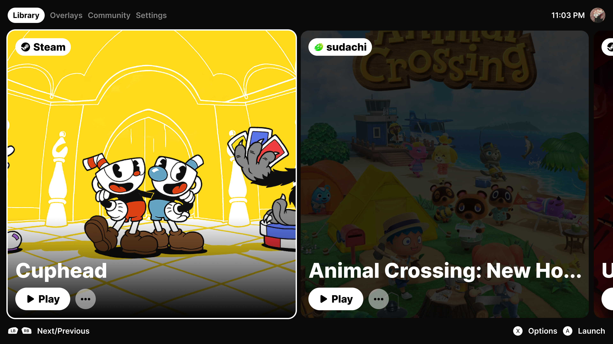

~ nichroma [in development]

minimal game library manager & launcher compatible with multiple sources and some other fun stuff.

</img>
> nichroma is a spiritual successor of [cheep](https://github.com/LuanderFarias/Cheep)

nichroma is a simple to use and minimal game library manager and launcher that includes all your games in one place using a well made backend instead of spending hours dealing with configurations and etc. made to be customizable and fully extendable by the community. you can suggest functions and sources opening an [issue](https://github.com/LuanderFarias/nichroma/issues/new).

~ supported storefronts
| platform | state |
| :-------- | :------------------------- |
| steam |  under development, [steamcmd](https://developer.valvesoftware.com/wiki/SteamCMD) & [depotdownlaoder](https://github.com/SteamRE/DepotDownloader) based. |
| epicgames | next on roadmap, [legendary](https://github.com/derrod/legendary) based. |
| amazon | planned, [nile](https://github.com/imLinguin/nile) based. |
| itch.io | planned, [butler](https://github.com/itchio/butler) & scrapping based. |
| gog | planned, [gogdl](https://github.com/Heroic-Games-Launcher/heroic-gogdl) based. |
> **this project is not affiliated with steam, epic games, amazon, itch.io or gog.**

~ supported emulators
| emulator | state |
| :-------- | :------------------------- |
| sudachi | under development. |
| ryujinx | planned. |
| yuzu | planned. |
| shadps4 | planned. |
| pcsx2 | planned. |
| rpcs3 | planned. |
| xemu | planned. |
| xenia | planned. |
| ppsspp | planned. |
| cemu | planned. |
| citra | planned. |
| citron | planned. |
| dolphin | planned. |
| duckstation | planned. |
| flycast | planned. |
| lime3ds | planned. |
| mgba | planned. |
| rmg | planned. |

~ other supported sources
| platform | state |
| :-------- | :------------------------- |
| .exe/.deb | done. |
| hydra | planned. |

~ manual-usage
1. clone repo
    ```
    git clone https://github.com/luanderfarias/nichroma
    ```
2. unzip
3. compile

    | os | command |
    | :--------------- | :------------------------- |
    | windows | ```not ready yet``` |
    | mac-os | ```not ready yet``` |
    | linux | ```not ready yet``` |
    > you might need to install the following dependencies: ```not ready yet``` depending on your linux distro
4. Run
    ```
    not ready yet
    ```

create stuff.
